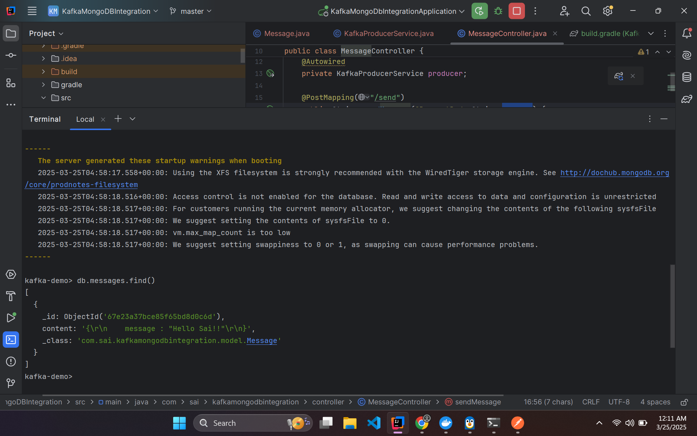
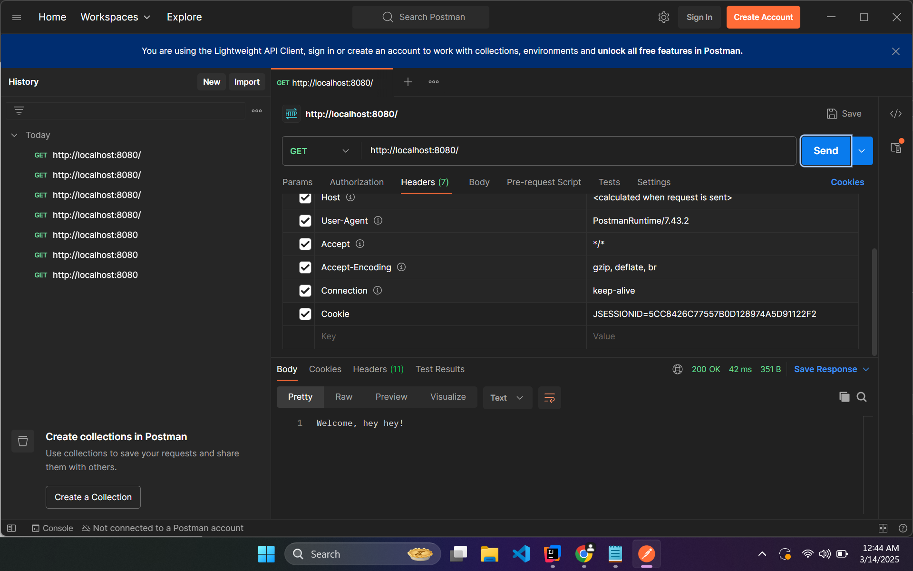

# Kafka-MongoDB Integration

## Overview
This app consumes the messages from kafka topic and save them to the DB
---

## Table of Contents

1. [Step 1: Preparation](#step-1-preparation)
2. [Step 2: Setup](#step-2-setup)
3. [Step 3: Execution](#step-3-execution)
4. [Step 4: Finalization](#step-4-finalization)

---

## Step 1: Preparation

### Subheading 1.1: Gather Required Tools
Before beginning, make sure you have the following items ready:
- Docker (you can download and install this from https://docs.docker.com/docker-for-windows/install/)

---

## Step 2: Setup

###
Setup your springboot project in your favourite ide and add the following dependencies:
- Spring Web
- Spring kafka
- Spring Data MongoDB

## Step 3: Execution

### Run the docker containers using the following command
docker-compose up -d

### Run the Springboot App
Run this SpringBoot App in your favourite ide

### Check the saved data in the DB
docker exec -it <mongo db container> mongo kafka-demo  
db.messages.find()

### close the containers
docker-compose down

## Step 4: Output

## Conclusion
Congratulations! You've successfully completed the process. You can now [next steps, e.g., use the results, share your work, etc.]. If you run into any issues, feel free to consult the troubleshooting section or contact support.
---